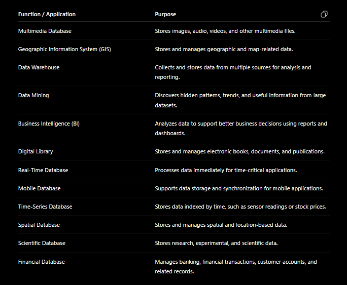

- Database Management Systems (DBMS) have evolved from handling simple data types like numbers and characters to supporting more complex data such as images, audio, and videos, each with specialized storage and retrieval methods.

- **Multimedia function**
	- Can store Text, Numbers, Images, Audios, and Videos.

- **Spatial data**
	- Geographic Information System (GIS) data, which involves spatial data requiring specific processing functions.

- **Time Series**
	- Time series data, such as stock market data recorded over time, enabling efficient storage, retrieval, and analysis, including snapshot functionalities.

- **Data Mining**
	- The integration of data mining capabilities within DBMS, which use algorithms like clustering, classification, and association rules to extract insights from data.
	- These built-in data mining functions, although sometimes limited in customization, help businesses, including small ones, to analyze their data effectively for purposes like customer segmentation and targeted marketing.

