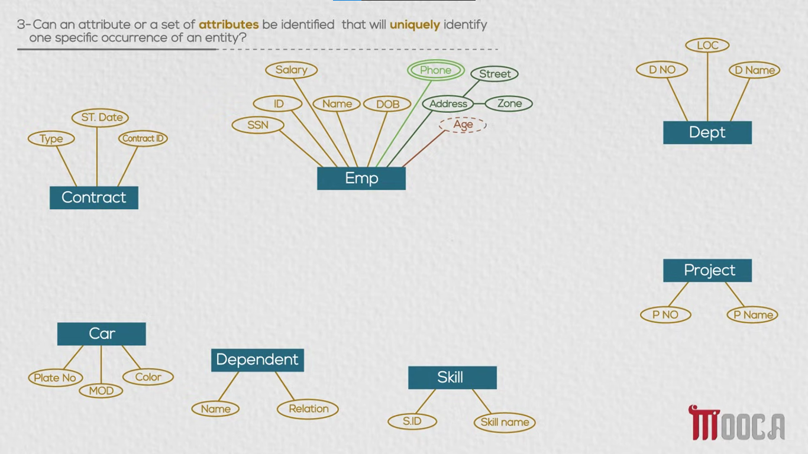
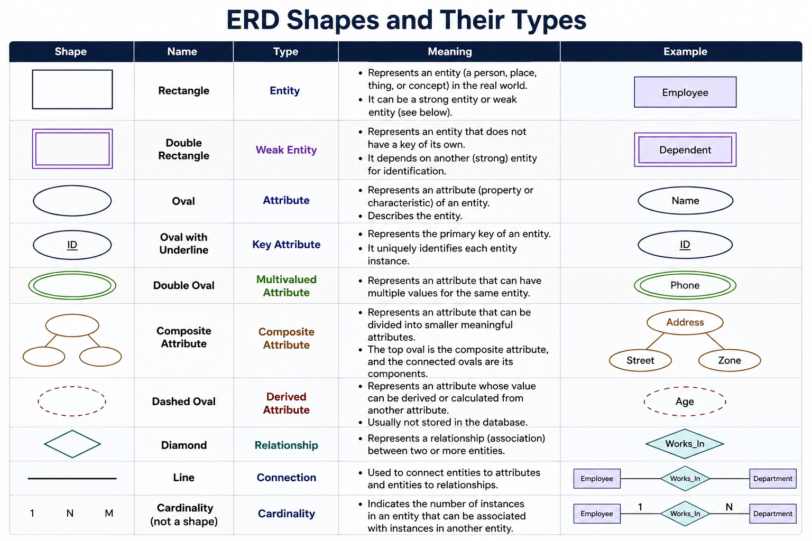

# Entities & Attributes

- In developing the Conceptual Design of a database, a number of guideline questions can be used to identify and classify the entities, attributes, and keys needed in the database.

- **Attribute Types:** Attributes can be classified based on how their values are represented or obtained.
    
    - **Simple Attribute:** An attribute that cannot be divided into smaller meaningful components.
        - For example, **Salary** of an Employee can be considered a simple attribute.
            
    - **Multivalued Attribute:** An attribute that can have more than one value for the same entity.
        - For example, an **Employee** can have multiple **Phone numbers**, such as a personal phone and a work phone.
            
    - **Composite Attribute:** An attribute that can be divided into smaller attributes, where each part has a meaningful value.
        - For example, an Employee's **Address** can be divided into **Street** and **Zone**.
            
    - **Derived Attribute:** An attribute whose value can be calculated or derived from another attribute.
        - For example, **Age** can be derived from the Employee's **DOB (Date of Birth)**, so Age does not necessarily need to be stored separately.
            

- **Candidate Key:**
    - A Candidate Key is an attribute or a set of attributes that can **uniquely identify one specific occurrence of an entity**.
    - For example, an Employee may have attributes such as **ID** and **SSN**. If both ID and SSN are unique for every Employee, then both can be Candidate Keys.
    - A Candidate Key must be **unique** and **minimal**, meaning that no unnecessary attributes are included.
    
- **Primary Key:**
    - If an entity has more than one Candidate Key, one of them can be selected as the **Primary Key** to uniquely identify each entity instance.
    - For example, if **ID** and **SSN** are both Candidate Keys for Employee, we can choose **ID** as the Primary Key, while SSN remains another Candidate Key.
        
- **Strong Entity:**
    - A Strong Entity is an entity that has its own key that can uniquely identify its occurrences.
    - For example, **Employee** can be a Strong Entity if every Employee has a unique **ID**.
    
- **Weak Entity:**
    - A Weak Entity is an entity that cannot be uniquely identified using only its own attributes.
    - It depends on another Strong Entity for its identification.
    - For example, **Dependent** may have attributes such as **Name** and **Relation**, but the Name of a Dependent may not be unique by itself.
    - If two different Employees both have a Dependent named Ahmed, we cannot identify the Dependent using Name alone. We need the Employee's identity together with the Dependent's information.
    - Therefore, **Dependent** can be considered a Weak Entity that depends on **Employee**.
    - In an ERD, a Weak Entity is represented using a **double-bordered rectangle**.
    
- Other entities in the company database include:
    - **Employee:** ID, SSN, Name, DOB, Salary, Phone, Address, and Age.
    - **Department:** DNO, D Name, and LOC.
    - **Project:** PNO and P Name.
    - **Car:** Plate No, MOD, and Color.
    - **Contract:** Contract ID, Type, and ST. Date.
    - **Skill:** S.ID and Skill Name.
    - **Dependent:** Name and Relation.
    
- The main idea is to determine which attributes describe each entity, which attributes can uniquely identify entity occurrences, and whether an entity can be identified independently or must depend on another entity.

### EX:

### ERD Shapes and Their types:

