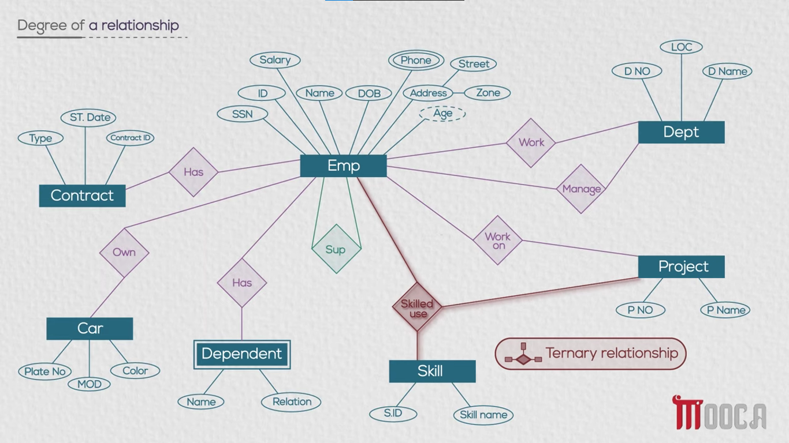

# Relationship - degree

## Relationships in Database Design

- A **Relationship** represents a connection between **two or more entities** in a database.
  - It describes how entities are **associated with each other**.
  - In an **ERD (Entity Relationship Diagram)**, a relationship is usually represented using a **diamond shape**.
  - The name of the relationship is written inside the diamond, such as **Work**, **Manage**, or **Own**.

- **Degree of a Relationship:** The degree of a relationship indicates the **number of entities involved in the relationship**.
  - Relationships can be classified based on their degree, such as **Unary**, **Binary**, and **Ternary** relationships.

  - **Unary Relationship:** A relationship that involves **only one entity**.
    - It is also called a **Recursive Relationship** because the same entity participates in the relationship more than once.
    - For example, the **Supervise** relationship connects the **Employee** entity to itself.
      - One **Employee** can supervise another **Employee**.
      - Therefore, only one entity type, **Employee**, participates in the relationship.
    - In the ERD, the relationship connects the entity to itself.
    - **Example:** **Employee — Supervise — Employee**.

  - **Binary Relationship:** A relationship that involves **two entities**.
    - It is the most common type of relationship in database design.
    - For example, the **Manage** relationship connects **Employee** and **Department**.
      - An **Employee** can manage a **Department**.
    - Other examples of Binary Relationships include:
      - **Employee — Work — Project**
        - An **Employee** can work on a **Project**.
      - **Employee — Has — Dependent**
        - An **Employee** can have one or more **Dependents**.
      - **Employee — Own — Car**
        - An **Employee** can own a **Car**.
      - **Employee — Has — Contract**
        - An **Employee** can have a **Contract**.

  - **Ternary Relationship:** A relationship that involves **three entities**.
    - For example, the **Skilled use** relationship involves:
      - **Employee**
      - **Project**
      - **Skill**
    - It represents which **Skill** an **Employee** uses while working on a particular **Project**.
    - Since three entities participate in the relationship, its degree is **3**, so it is called a **Ternary Relationship**.
    - **Example:**
      - **Employee + Project + Skill → Skilled use**

- Other relationships in the company database include:
  - **Manage:** connects **Employee** and **Department**.
  - **Work:** connects **Employee** and **Project**.
  - **Has:** connects **Employee** and **Dependent**.
  - **Supervise:** a **Unary/Recursive Relationship** involving **Employee** with itself.
  - **Own:** connects **Employee** and **Car**.
  - **Has:** connects **Employee** and **Contract**.
  - **Skilled use:** a **Ternary Relationship** involving **Employee**, **Project**, and **Skill**.

### EX:

### Relationship Degree Summary:

- **Unary Relationship:**
  - Involves **one entity**.
  - Also called a **Recursive Relationship**.
  - Example: **Employee — Supervise — Employee**.

- **Binary Relationship:**
  - Involves **two entities**.
  - Examples:
    - **Employee — Manage — Department**
    - **Employee — Work — Project**
    - **Employee — Own — Car**

- **Ternary Relationship:**
  - Involves **three entities**.
  - Example:
    - **Employee + Project + Skill → Skilled use**

- The main idea is that the **degree of a relationship** tells us **how many entities participate in that relationship**.
  - **Unary = 1 entity**
  - **Binary = 2 entities**
  - **Ternary = 3 entities**

### ERD Shapes and Their Types:

- **Rectangle:** represents an **Entity**.
- **Double Rectangle:** represents a **Weak Entity**.
- **Oval:** represents an **Attribute**.
- **Double Oval:** represents a **Multivalued Attribute**.
- **Dashed Oval:** represents a **Derived Attribute**.
- **Diamond:** represents a **Relationship**.
- **Double Diamond:** represents an **Identifying Relationship** for a Weak Entity.