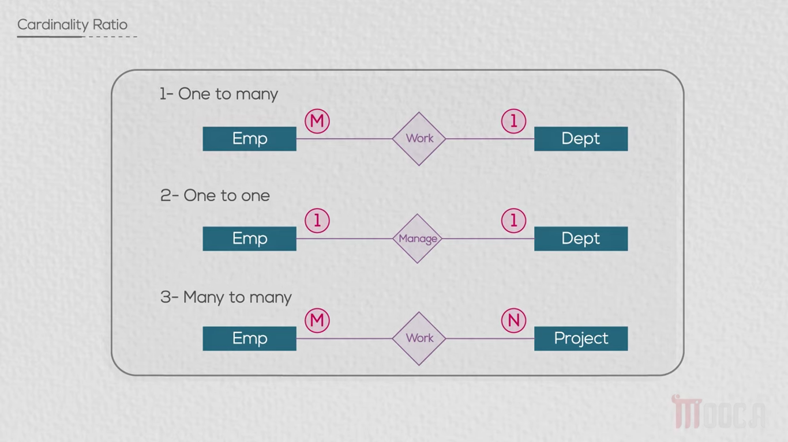
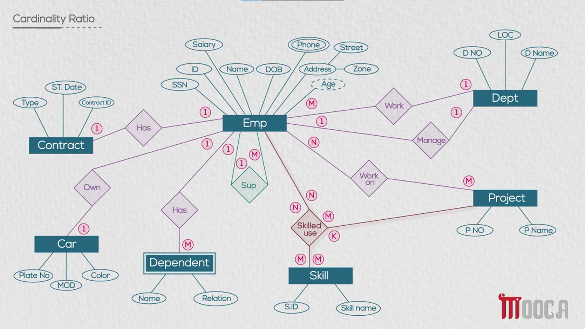

# Cardinality Ratio

- A **Cardinality Ratio** specifies the **maximum number of relationship instances** that an entity can participate in through a relationship.
- It describes how many occurrences of one entity can be associated with occurrences of another entity.
- The most common Cardinality Ratios are:
  - **1 : 1 (One-to-One)**
  - **1 : M (One-to-Many)**
  - **M : N (Many-to-Many)**

- **One-to-One (1 : 1):** A relationship where one occurrence of an entity can be associated with **at most one occurrence** of another entity.
  - For example, an **Employee** can own **at most one Car**.
    - Each **Employee** can be associated with one **Car**.
    - Each **Car** is associated with one **Employee**.
  - Another example is the **Contract** relationship:
    - An **Employee** can have **only one Contract at a time**.
    - Therefore, the relationship can be represented as **1 : 1**.

- **One-to-Many (1 : M):** A relationship where one occurrence of an entity can be associated with **many occurrences** of another entity, while each occurrence on the other side is associated with at most one occurrence of the first entity.
  - For example, the **Work** relationship between **Employee** and **Department**:
    - One **Department** can have **many Employees**.
    - Each **Employee** works in **only one Department**.
    - Therefore, the Cardinality Ratio is **1 : M**.
  - In the ERD:
    - **Employee → 1 Department**
    - **Department → M Employees**

- **Many-to-Many (M : N):** A relationship where one occurrence of an entity can be associated with **many occurrences** of another entity, and vice versa.
  - For example, the **Work on** relationship between **Employee** and **Project**:
    - One **Employee** can work on **many Projects**.
    - One **Project** can have **many Employees**.
    - Therefore, the Cardinality Ratio is **M : N**.
  - In the ERD:
    - **Employee → M Projects**
    - **Project → M Employees**

- **Unary (Recursive) Relationship:** A Cardinality Ratio can also be used with a relationship where an entity is related to **itself**.
  - For example, the **Supervise** relationship connects **Employee** to **Employee**.
    - One **Employee** can supervise **many Employees**.
    - Each **Employee** can have **only one Supervisor**.
    - Therefore, the Cardinality Ratio is **1 : M**.
  - The two roles of the same entity are:
    - **Supervisor:** can supervise **many Employees**.
    - **Supervisee:** has **one Supervisor**.

- **Ternary Relationship:** A relationship involving **three entities** can also have a Cardinality Ratio.
  - For example, the **Skilled use** relationship involves:
    - **Employee**
    - **Project**
    - **Skill**
  - An **Employee** can use many **Skills** on many **Projects**.
  - A **Project** can involve many **Employees** using many **Skills**.
  - A **Skill** can be used by many **Employees** on many **Projects**.
  - Therefore, the relationship can have a **M : N : K** cardinality ratio.
  - The cardinality must be **consistent across all branches** of the ternary relationship.

### EX:

- From the diagram:
  - **Employee — Own — Car:** **1 : 1**
    - An **Employee** can own at most **one Car**.
    - A **Car** can belong to at most **one Employee**.
  - **Employee — Has — Contract:** **1 : 1**
    - An **Employee** can have at most **one Contract at a time**.
  - **Employee — Work — Department:** **M : 1**
    - Many **Employees** can work in one **Department**.
    - One **Department** can have many **Employees**.
  - **Employee — Manage — Department:** **1 : 1**
    - An **Employee** can manage one **Department**.
    - A **Department** has one **Manager**.
  - **Employee — Work on — Project:** **M : N**
    - An **Employee** can work on many **Projects**.
    - A **Project** can have many **Employees**.
  - **Employee — Has — Dependent:** **1 : M**
    - An **Employee** can have many **Dependents**.
    - Each **Dependent** belongs to one **Employee**.
  - **Employee — Supervise — Employee:** **1 : M**
    - One **Employee** can supervise many **Employees**.
    - Each **Employee** has one **Supervisor**.
  - **Employee + Project + Skill — Skilled use:** **N : M : K**
    - The relationship involves **three entities**.
    - Each branch can have a **many** cardinality.

- The main idea is that the **Cardinality Ratio** tells us the **maximum number of relationship instances** an entity can participate in.
  - **1 : 1 → One-to-One**
  - **1 : M → One-to-Many**
  - **M : N → Many-to-Many**
  - For a **Ternary Relationship**, the ratio can involve three values, such as **N : M : K**.

