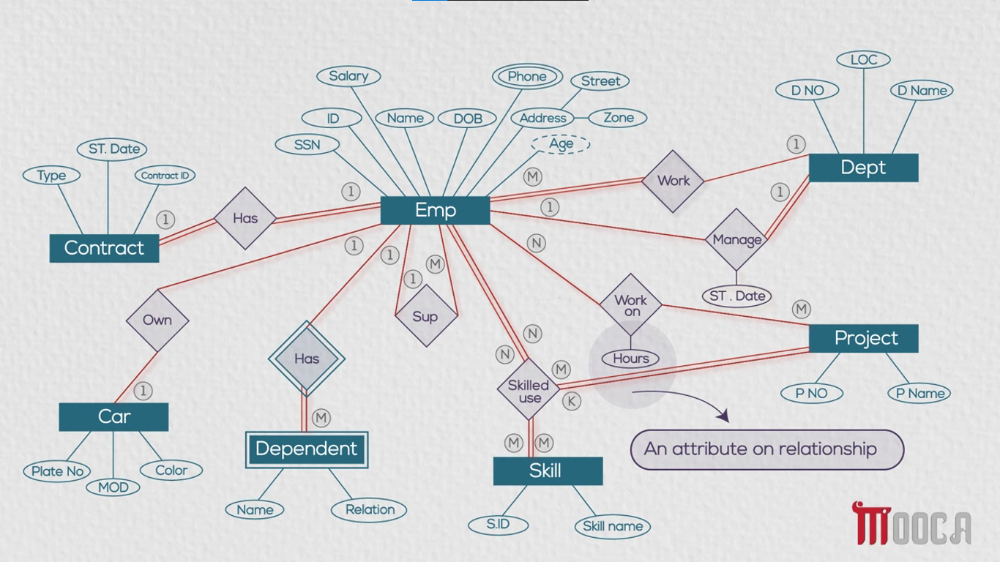

- Participation Constraints & ERD Relationships:
    - Participation indicates the minimum number of relationship instances in which an entity instance must participate.
    - Total Participation (Mandatory / Must):
        - Represented by a double line in ERD.
        - Means every instance of the entity must participate in the relationship.
        - For example, an Employee must work in a Department, or a Dependent must have a supporting Employee.
    - Partial Participation (Optional / May):
        - Represented by a single line in ERD.
        - Means an instance of the entity may participate in the relationship, but it is not mandatory.
        - For example, an Employee may or may not own a Car, or an Employee may or may not manage a Department.

- Relationship Types and Notations:
    - Identifying Relationship:
        - Represented by a double diamond symbol.
        - Used to connect a Weak Entity to its identifying Strong Entity.
        - For example, the **Has** relationship between **Emp** (Strong Entity) and **Dependent** (Weak Entity).
    - Recursive / Self-Referencing Relationship:
        - An entity relates to itself in a supervisory or hierarchical structure.
        - For example, the **Sup** relationship where an **Emp** supervises another **Emp**.
    - Ternary Relationship:
        - Connects three different entities simultaneously within a single relationship context.
        - For example, **Skilled use** connects **Emp**, **Project**, and **Skill**.
    - Attributes on Relationships:
        - Attributes that belong to the relationship itself rather than to any single participating entity.
        - For example, **ST. Date** on the **Manage** relationship (specifies when an Employee started managing a Department).
        - For example, **Hours** on the **Work on** relationship (specifies the number of hours an Employee spends on a specific Project).

#### ERD Representation:

