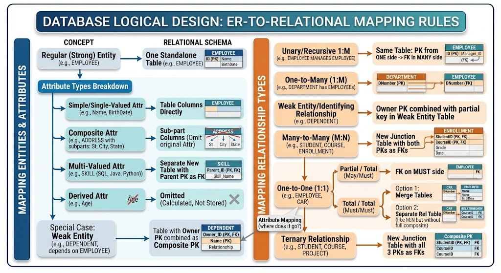

# ER Model to Relational Schema Mapping Rules

- **Overview of ER-to-Relational Mapping Workflow:**
    - The main goal is to convert the **Conceptual ER Model** into a logical **Relational Schema**.
    - The ER Model contains Entities, Attributes, and Relationships.
        - Each Entity is represented as a table.
        - Each Attribute is represented as a column when it needs to be stored.
        - The mapping rules determine where **Primary Keys** and **Foreign Keys** are placed to preserve the relationships between Entities.
    - The result should be an efficient and consistent Relational Database with minimum data **Redundancy**.

- **Entity & Attribute Mapping Rules:**
    - **Regular (Strong) Entity:**
        - Mapped directly to an independent table.
        - The Entity's Primary Key becomes the **Primary Key** of its table.

    - **Simple / Single-Valued Attribute:**
        - Mapped directly as a column in the Entity table.
        - For example, `Salary` becomes a `Salary` column in the Employee table.

    - **Composite Attribute:**
        - Break down the Composite Attribute into its individual sub-parts.
        - Each sub-part becomes a separate column.
        - The original Composite Attribute container is omitted.
        - For example, `Name` can be mapped into:
            - `FirstName`
            - `LastName`

    - **Multi-Valued Attribute:**
        - Mapped to a separate new table.
        - The new table stores:
            - The Multi-Valued Attribute.
            - The Parent Entity's Primary Key as a **Foreign Key**.
        - This preserves the relationship with the Parent Entity and avoids storing multiple values in one column.

    - **Derived Attribute:**
        - Omitted from the logical mapping.
        - Calculated dynamically when it is needed.
        - For example, `Age` can be calculated instead of being stored.

    - **Weak Entity:**
        - The Owner Entity's Primary Key is included in the Weak Entity table as a **Foreign Key**.
        - The Owner Entity's Primary Key is combined with the Weak Entity's **Partial Key (Discriminator)**.
            - Together, they form the **Composite Primary Key** of the Weak Entity table.

- **Relationship Mapping Rules:**
    - **One-to-Many (1 : M) Relationship:**
        - Move the Primary Key from the **One side** to the **Many side** table.
        - It becomes a **Foreign Key** in the Many side table.
        - For example, the Primary Key of Department is placed in the Employee table as a Foreign Key.

    - **Many-to-Many (M : N) Relationship:**
        - Create a new **Junction / Bridge Table**.
        - The Junction Table contains:
            - The Primary Key of the first Entity as a Foreign Key.
            - The Primary Key of the second Entity as a Foreign Key.
            - Both Foreign Keys together form the **Composite Primary Key**.
        - Relationship Attributes are stored in the Junction Table.

    - **One-to-One (1 : 1) Relationship:**
        - The mapping depends on the **Participation Constraints** of the two Entities.
        - **Partial / Total (May / Must):**
            - Place the Foreign Key on the mandatory / Total side.
        - **Total / Total (Must / Must):**
            - There are two possible approaches:
                - Merge the two tables into one table.
                - Create a dedicated relationship table.

    - **Ternary Relationship:**
        - A relationship that involves three Entities.
        - Create a separate table for the relationship.
            - Put the Primary Key of each of the three Entities in the new table.
            - These Primary Keys become Foreign Keys.
            - The three Foreign Keys together form the **Composite Primary Key**.

    - **Relationship Attributes:**
        - Attributes that belong to the relationship itself are stored in the table that holds the Foreign Key of that relationship.
        - For a Many-to-Many or Ternary Relationship:
            - Store the Relationship Attributes in the Junction Table or the separate relationship table.
        - For example:
            - `Hours`
            - `Start_Date`

- **Main Exam Revision Points:**
    - **1 : M:** Move the Primary Key from the One side to the Many side as a Foreign Key.
    - **M : N:** Create a Junction Table with both Primary Keys as Foreign Keys and a Composite Primary Key.
    - **1 : 1:** Use the Participation Constraints to decide where the Foreign Key is placed or whether tables are merged.
    - **Ternary:** Create a separate table with the three Entity Primary Keys as Foreign Keys and a Composite Primary Key.
    - **Weak Entity:** Use the Owner Entity's Primary Key with the Partial Key to form a Composite Primary Key.
    - **Derived Attribute:** Do not store it; calculate it dynamically.

### EX:

