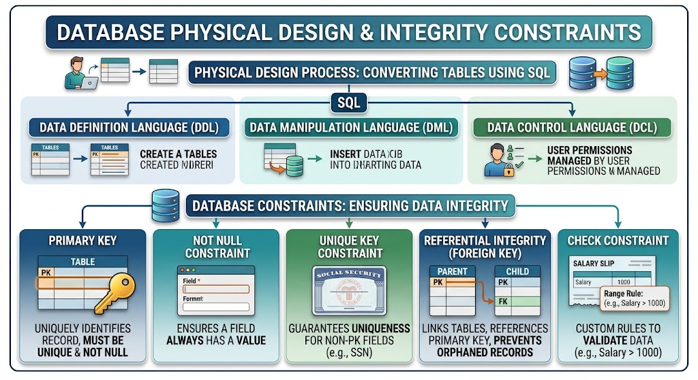

# Physical Database Design & SQL

- **Physical Database Design:**
    - **Physical Design** is the stage where a database design is converted into an actual database inside a Database Management System (DBMS).
    - It explains how the logical design will be implemented as real database structures.
        - A designed **Entity** is implemented as a **Table**.
        - An **Attribute** of an entity is implemented as a **Column** in that table.
        - The values stored for one entity instance are implemented as a **Record / Row**.
        - The appropriate **Keys**, **Data Types**, and **Constraints** are defined so that the stored data and the relationships between tables are correct.
    - The relationship between design and implementation can be understood as follows:
        - **Database Design:**
            - Describes what data is needed and how the data is related.
        - **Tables:**
            - Organize the designed data into rows and columns.
        - **Data:**
            - Is the actual information stored inside the tables.
        - **SQL:**
            - Is used to create the tables, define their columns and rules, and work with their data.
        - **Database Implementation:**
            - Is the final result of applying the design using SQL in the DBMS.
    - Therefore, Physical Design turns the database design into usable database objects and stored data.

- **SQL Categories:**
    - SQL commands are grouped according to their purpose.
    - **Data Definition Language (DDL)**
    - **Data Manipulation Language (DML)**
    - **Data Control Language (DTL)**

- **Data Design / Data Objects:**
    - **Data Design** is a collection of related data objects created by a database designer.
    - These objects represent the structure of the database and organize how data will be stored and related.
        - **Tables:**
            - Represent collections of related data.
        - **Columns / Attributes:**
            - Represent the properties stored for each record in a table.
        - **Keys:**
            - Identify records and connect related tables.
        - **Constraints:**
            - Apply rules that validate data and maintain Data Integrity.
        - **Relationships between Tables:**
            - Describe how data in one table is connected to data in another table.
    - Together, these data objects provide the structure that is implemented during Physical Design.

- **Data Types:**
    - Every Field / Column needs a suitable **Data Type** according to the kind of value it will store.
    - Choosing the correct data type helps the database store and validate data appropriately.
        - **Alphanumeric / Character Data:**
            - Stores letters, numbers, or text.
            - Examples:
                - `Employee_Name`
                - `Department_Name`
                - A value such as `'Ahmed'` or `'HR01'`.
        - **Numeric Data:**
            - Stores numerical values used in calculations or measurements.
            - Example:
                - `Salary`.
        - **Date / Time Data:**
            - Stores a date, a time, or both.
            - Example:
                - `Hire_Date`.
        - **Integer:**
            - Stores whole numbers without a decimal part.
            - Example:
                - `Employee_ID` with a value such as `101`.
        - **Float:**
            - Stores numbers that contain a decimal part.
            - Example:
                - A value such as `3.75`.

- **Database Constraints (Data Integrity):**
    - **Constraints** are rules applied to columns or tables.
    - Their purpose is to maintain **Data Integrity** by keeping the database data correct, consistent, and valid.
        - They prevent invalid data from being stored.
        - They prevent inconsistent data between related tables.
        - They prevent duplicate data when duplication violates a defined rule.

    - **Primary Key Constraint:**
        - A **Primary Key** uniquely identifies each Record / Row in a table.
        - Every Primary Key value must be:
            - **Unique:**
                - The same value cannot appear in more than one record.
            - **Not Null:**
                - The value cannot be `NULL`.
        - A table normally has one Primary Key constraint.
            - The Primary Key may contain more than one column.
            - In this case, it is called a **Composite Primary Key**.
        - Example: the `Employee` table contains:
            - `Employee_ID`
            - `Name`
            - `Salary`
        - `Employee_ID` can be the Primary Key because it gives every employee a distinct identifier.
        - SQL example:
            ```sql
                CREATE TABLE Employee (
                    Employee_ID INT PRIMARY KEY,
                    Name VARCHAR(100),
                    Salary DECIMAL(10,2)
                );
            ```

    - **NOT NULL Constraint:**
        - **NOT NULL** ensures that a column must contain a value.
        - It prevents `NULL` from being stored in that column.
        - It is used when a field is mandatory for every record.
        - Example:
            - `Employee_Name` can be defined as `NOT NULL` because an employee record should contain the employee's name.
            - A `NULL` value means that no value is stored for that field.
        - SQL example:
            ```sql
                Employee_Name VARCHAR(100) NOT NULL
            ```

    - **UNIQUE Key Constraint:**
        - A **UNIQUE** constraint guarantees that values in a column are not duplicated.
        - It is useful for a value that must be different for each person or record but is not selected as the Primary Key.
        - Example:
            - A **Social Security Number (SSN)** should be unique for each person.
            - Therefore, two different people should not be allowed to have the same `SSN`.
        - SQL example:
            ```sql
                SSN VARCHAR(20) UNIQUE
            ```
        - **UNIQUE vs Primary Key:**
            - **Primary Key:**
                - Identifies each record in the table.
                - Must be unique and cannot be `NULL`.
            - **UNIQUE:**
                - Prevents duplicate values in the constrained column.
                - Can be applied to data that is unique but is not the table's identifying key.

    - **Foreign Key / Referential Integrity Constraint:**
        - A **Foreign Key** creates a valid relationship between tables.
        - It references a key in another table, commonly that table's Primary Key.
        - It maintains **Referential Integrity**.
            - A reference in one table must point to a valid, existing record in the related table.
            - Invalid references and orphaned records are prevented when the Foreign Key constraint is enforced.
        - Example: `Department` and `Employee` tables:
            - `Department`
                - `Department_ID` → **Primary Key**
                - `Department_Name`
            - `Employee`
                - `Employee_ID` → **Primary Key**
                - `Name`
                - `Department_ID` → **Foreign Key**
            - The relationship is:
                - `Employee.Department_ID`
                    - References `Department.Department_ID`.
            - Invalid case:
                - If `Department_ID = 50` does not exist in the `Department` table, an `Employee` should not be allowed to reference `Department_ID = 50`.
        - This implements the previously studied idea of **Mapping Relationship Types**.
            - The **ONE** side contains the Primary Key.
            - The **MANY** side stores that value as a Foreign Key.
            - In this example:
                - One Department can have many Employees.
                - `Department.Department_ID` is the Primary Key on the ONE side.
                - `Employee.Department_ID` is the Foreign Key on the MANY side.
        - SQL example:
            ```sql
                CREATE TABLE Employee (
                    Employee_ID INT PRIMARY KEY,
                    Name VARCHAR(100),
                    Department_ID INT,
                    FOREIGN KEY (Department_ID) REFERENCES Department(Department_ID)
                );
            ```

    - **CHECK Constraint:**
        - A **CHECK Constraint** allows the database designer to define a custom condition for a value.
        - Values inserted or updated in the constrained column must satisfy that condition.
        - It is useful for enforcing business rules or data rules.
        - Example: an employee salary must be within an allowed range.
            ```sql
                Salary DECIMAL(10,2)
                CHECK (Salary >= 3000 AND Salary <= 100000)
            ```
        - This condition means:
            - The salary must be at least `3000`.
            - The salary must not be greater than `100000`.
            - A salary outside this range cannot be stored when the constraint is enforced.

- **Relationship Between Constraints and Data Integrity:**
    - Each constraint protects a different aspect of data quality.
        - **PRIMARY KEY:**
            - Identifies records uniquely.
            - Ensures that every record can be distinguished from the others.
        - **NOT NULL:**
            - Ensures required values exist.
            - Prevents mandatory fields from being stored without a value.
        - **UNIQUE:**
            - Prevents duplicate values in columns that require distinct values.
        - **FOREIGN KEY:**
            - Maintains valid relationships between tables.
            - Supports Referential Integrity by preventing invalid references.
        - **CHECK:**
            - Enforces custom conditions on values.
            - Prevents values that do not satisfy the defined rule.
    - When these constraints work together, the database becomes:
        - More **Reliable**:
            - Records can be identified and required data is present.
        - More **Consistent**:
            - Related tables use valid references.
        - More **Valid**:
            - Stored values follow the rules defined by the designer.
        - Better protected against **Invalid Data**:
            - Duplicate, missing, out-of-range, and invalid referenced values are controlled.
        - Structurally correct:
            - Tables and their relationships follow the intended database design.


- #### SUMMARY:
    - **PRIMARY KEY vs UNIQUE:**
        - **Primary Key:**
            - Identifies each Record / Row in a table.
            - Must be unique and cannot be `NULL`.
        - **UNIQUE:**
            - Prevents duplicate values in the constrained column.
            - Is used for a unique value that is not necessarily the Primary Key.
    - **PRIMARY KEY vs FOREIGN KEY:**
        - **Primary Key:**
            - Identifies records inside its own table.
        - **Foreign Key:**
            - References a key in another table.
            - Connects related tables and supports Referential Integrity.
    - **NOT NULL vs UNIQUE:**
        - **NOT NULL:**
            - A value must exist.
        - **UNIQUE:**
            - A value cannot be duplicated.
        - A column can use both constraints when its value must exist and must be different in every record.
    - **Foreign Key and Referential Integrity:**
        - A Foreign Key ensures that references between tables point to valid, existing records.
        - This keeps relationships between tables correct and prevents orphaned references.
    - **CHECK Constraint and Custom Validation:**
        - A CHECK Constraint differs from the other constraints because the database designer defines the specific condition.
        - Example:
            - A `Salary` value must be between `3000` and `100000`.



