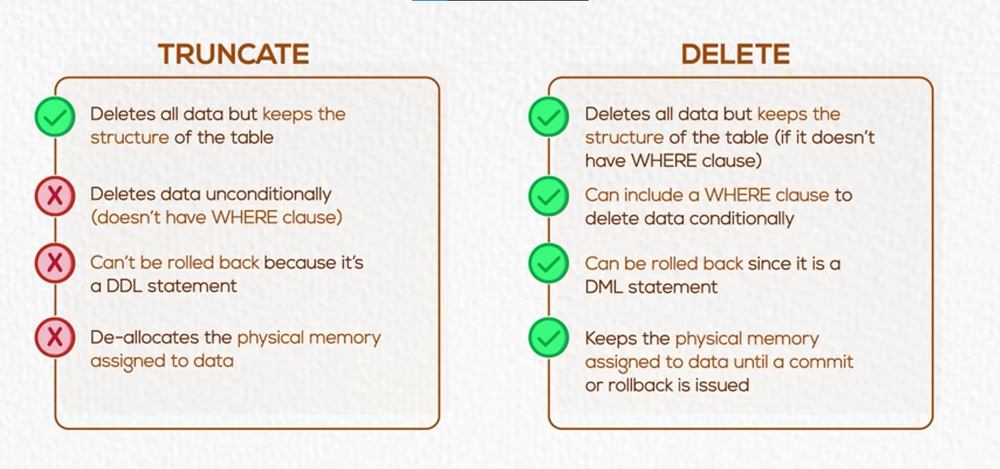

# SQL - DELETE Command and TRUNCATE

- **DELETE Command:**
    - `DELETE` is a **Data Manipulation Language (DML)** command.
    - It is used to remove Records from a Table.
    - The basic structure is:
        ```sql
            DELETE FROM Table_Name
            WHERE Condition;
        ```
    - The statement contains:
        - `DELETE FROM`:
            - Specifies that Records will be removed from a Table.
        - `Table_Name`:
            - Specifies the Table from which Records will be deleted.
        - `WHERE`:
            - Specifies the Record or Records that should be deleted.

- **Delete Specific Records:**
    - Use the `WHERE` clause when only specific Records should be removed.
    - Example:
        ```sql
            DELETE FROM Employee
            WHERE SSN = 123456789;
        ```
    - In this statement:
        - The `Employee` Table is the Table being modified.
        - `WHERE SSN = 123456789` identifies the Employee Record that should be deleted.
        - Only Records that meet the `WHERE` Condition are deleted.

- **Delete All Records:**
    - If `WHERE` is omitted, all Records in the Table are deleted.
    - Example:
        ```sql
            DELETE FROM Employee;
        ```
    - In this example:
        - All Records are removed from the `Employee` Table.
        - The Table itself remains available.
        - The `DELETE` statement can still be rolled back before committing the transaction.

- **TRUNCATE Command:**
    - `TRUNCATE` is a **Data Definition Language (DDL)** command.
    - It removes all Data from a Table.
    - The basic structure is:
        ```sql
            TRUNCATE TABLE Table_Name;
        ```
    - Example:
        ```sql
            TRUNCATE TABLE Employee;
        ```
    - In this example:
        - All Data is removed from the `Employee` Table.
        - Specific Records cannot be selected for deletion.
        - `TRUNCATE` performs an automatic `COMMIT`.
        - The operation cannot be rolled back.
    - `TRUNCATE` removes all Data more efficiently than deleting all Records with `DELETE`.

- **DELETE vs TRUNCATE:**
    - **DELETE:**
        - Is a DML command.
        - Can delete specific Records by using a `WHERE` clause.
        - Can delete all Records when `WHERE` is omitted.
        - Supports `ROLLBACK` before the transaction is committed.
    - **TRUNCATE:**
        - Is a DDL command.
        - Removes all Data from a Table.
        - Cannot delete specific Records because it does not use a `WHERE` clause.
        - Performs an automatic `COMMIT`.
        - Cannot be rolled back.
        - Is used to clear all Data from a Table efficiently.
    -  

- **When to Use Each Command:**
    - Use `DELETE` when:
        - Specific Records must be deleted.
        - A `WHERE` condition is needed.
        - The option to use `ROLLBACK` before committing is required.
    - Use `TRUNCATE` when:
        - All Data in the Table should be removed.
        - Specific Records do not need to be selected.
        - The action does not need to be undone.
        - Data must be cleared quickly.

- #### SUMMARY:
    - **DELETE:**
        - A DML command used to delete specific Records or all Records from a Table.
        - `WHERE` identifies the Records to delete.
        - Supports `ROLLBACK` before committing.
    - **TRUNCATE:**
        - A DDL command used to remove all Data from a Table.
        - Cannot delete specific Records.
        - Performs an automatic `COMMIT` and cannot be rolled back.
