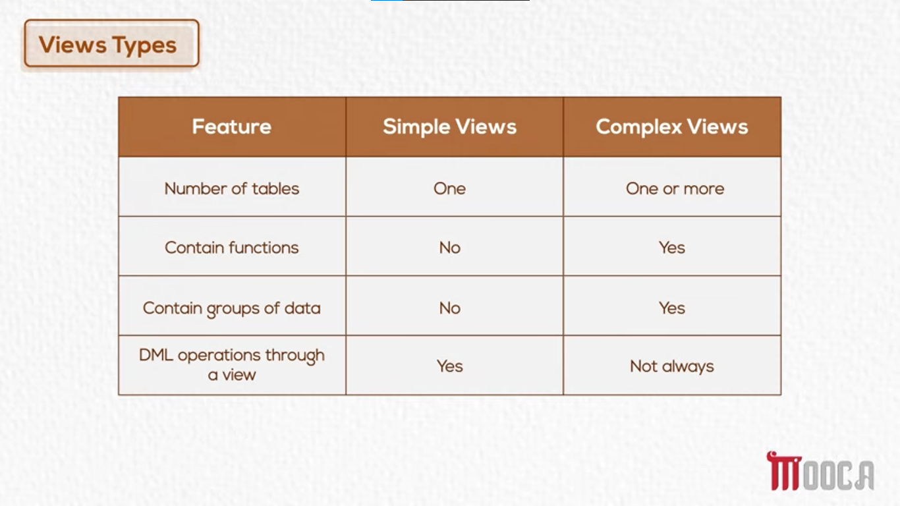

# SQL - Views

- **View:**
    - A **View** is a Database Object that is considered a Logical Table.
    - It is built upon one or more underlying Tables or other Views.
    - A View does not contain its own Data.
        - It provides access to Data that is stored elsewhere.
        - It can be understood as a window to the underlying Data.
        - It is similar to a shortcut to a folder.
            - The shortcut does not contain the files itself.
            - It provides access to the original folder that contains the files.
    - The Tables on which a View is built are called **Base Tables**.
    - When a View is created:
        - Its `SELECT` statement is stored in the Metadata / Data Dictionary.
        - The View can be used as a regular Database Object.

- **CREATE VIEW Statement:**
    - The `CREATE VIEW` statement is used to create a new View.
    - When creating a View, specify:
        - The View Name.
        - The Columns that should be displayed.
        - The `SELECT` statement on which the View will be based.
    - The `SELECT` statement can retrieve Data from multiple Base Tables using Joins.
    - The basic structure is:
        ```sql
            CREATE VIEW View_Name AS
            SELECT Column1, Column2, ...
            FROM Table_Name;
        ```

- **Create a View Using Multiple Tables:**
    - A View can combine Data from more than one Base Table.
    - The following View displays the Employee Name, Project Name, and number of Hours worked on each Project:
        ```sql
            CREATE VIEW VW_Work_Hours AS
            SELECT FirstName, LastName, ProjectName, Hours
            FROM Employee
            JOIN WorksOn ON Employee.EmployeeID = WorksOn.EmployeeID
            JOIN Project ON WorksOn.ProjectID = Project.ProjectID;
        ```
    - In this statement:
        - `VW_Work_Hours` is the View Name.
        - `Employee`, `WorksOn`, and `Project` are the Base Tables.
        - The View displays Data from three Tables through the Join Conditions.
        - The View contains the following displayed information:
            - `FirstName`
            - `LastName`
            - `ProjectName`
            - `Hours`

- **Retrieve Data from a View:**
    - After a View is created, it can be queried in the same way as a Table.
    - Specific Columns can be selected from a View.
        - Example:
            ```sql
                SELECT FirstName, LastName, Hours
                FROM VW_Work_Hours;
            ```
    - All Columns can be selected from a View.
        - Example:
            ```sql
                SELECT *
                FROM VW_Work_Hours;
            ```

- **Views and Data Access Restriction:**
    - Access Privileges are managed at the Database Object level.
    - A View can be used to give a User access to only the required Data.
        - For example, a User can be given `SELECT` Privilege on a View that displays only four required Columns.
        - The User does not necessarily need access to all Base Tables.
    - This helps prevent access to Data that should not be available to the User.
        - For example, Salary Data can remain unavailable when it is not included in the View.

- **Create a View with a Condition:**
    - A View can include a `WHERE` clause to display only Rows that meet a Condition.
    - Example:
        ```sql
            CREATE VIEW Suppliers AS
            SELECT *
            FROM SuppliersTable
            WHERE Status > 15
            WITH CHECK OPTION;
        ```
    - In this statement:
        - The View displays only Suppliers whose `Status` is greater than `15`.
        - `WITH CHECK OPTION` applies the View Condition to DML operations performed through the View.
            - An `INSERT` or `UPDATE` through the View must satisfy `Status > 15`.
            - For example, inserting a Supplier with a `Status` of `10` through this View is rejected.

- **DML Operations on Views:**
    - `INSERT`, `UPDATE`, and `DELETE` operations can be performed through a View, but with limitations.
    - Because a View is linked to the underlying Data:
        - DML commands performed through the View are executed on the Base Tables.
    - When `WITH CHECK OPTION` is used:
        - The system checks the Data against the View Condition before allowing the DML operation.

- **Modify / Redefine a View:**
    - The `CREATE OR REPLACE VIEW` statement is used to modify or redefine a View.
    - If the View already exists:
        - Its definition is replaced.
    - If the View does not exist:
        - A new View is created.
    - Example:
        ```sql
            CREATE OR REPLACE VIEW Dept5Employees AS
            SELECT EmployeeName, ProjectName, Hours
            FROM Employee
            JOIN WorksOn ON Employee.EmployeeID = WorksOn.EmployeeID
            JOIN Project ON WorksOn.ProjectID = Project.ProjectID
            WHERE DepartmentID = 5;
        ```
    - In this statement:
        - `Dept5Employees` displays only Employees from Department `5`.
        - The View combines Employee, Project, and Hours information.

- **Remove a View:**
    - The `DROP VIEW` statement is used to remove a View.
    - The basic structure is:
        ```sql
            DROP VIEW ViewName;
        ```

- **Advantages of Using Views:**
    - **Data Access Restriction:**
        - A View can limit a User's access to specific Columns or Rows.
        - This improves Data Security.
    - **Simplify Complex Queries:**
        - Complex Joins and Conditions can be stored in a View.
        - The View can then be queried without writing the complex query again.
    - **Data Independence:**
        - A View provides a level of abstraction from the Base Tables.
        - Changes to underlying Tables, such as adding new Columns, do not necessarily affect applications that use the View.
    - **Role-Based Data Presentation:**
        - Different Users can be given different Views.
        - Each User can access the Data that is relevant to their role.

- **Types of Views:**
    - **Simple View:**
        - Built on a single Table.
        - Does not contain Functions or Aggregations.
        - `INSERT`, `UPDATE`, and `DELETE` operations can be performed through the View if Constraints are not violated.
    - **Complex View:**
        - Built on multiple Tables.
        - May contain Functions, Aggregations, and Grouping.
        - DML operations are often limited or not allowed because the View contains complex logic.
        
    - 

- #### SUMMARY:
    - **View:**
        - A Logical Table that does not store its own Data.
        - Is based on one or more Base Tables or other Views.
    - **CREATE VIEW:**
        - Creates a View from a `SELECT` statement.
    - **Query a View:**
        - A View can be queried using `SELECT` as if it were a Table.
    - **WITH CHECK OPTION:**
        - Ensures that `INSERT` and `UPDATE` operations through a View satisfy its `WHERE` Condition.
    - **CREATE OR REPLACE VIEW:**
        - Creates a new View or replaces an existing View definition.
    - **DROP VIEW:**
        - Removes a View.
    - **Simple View:**
        - Based on one Table and allows DML operations when Constraints are not violated.
    - **Complex View:**
        - May use multiple Tables, Functions, Aggregations, or Grouping.
        - DML operations are often limited or unavailable.
