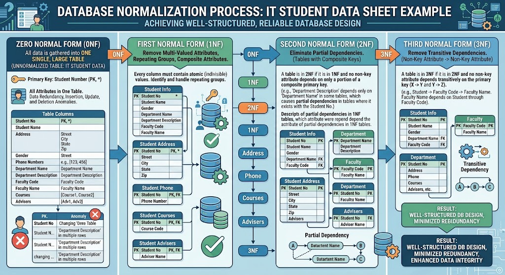

# Database Normalization - Summary Example

- **Normalization Example:**
    - The example uses an IT Student's Data Sheet.
    - The Data is normalized step by step:
        - Zero Normal Form (0NF).
        - First Normal Form (1NF).
        - Second Normal Form (2NF).
        - Third Normal Form (3NF).
    - Each step improves the Database Design by reducing Data Redundancy and maintaining Data Integrity.

- **Zero Normal Form (0NF):**
    - In **Zero Normal Form (0NF)**, all Data is gathered in one Table.
    - The `Student Number` is used as the Primary Key.
    - The single Table may contain:
        - Student Data.
        - Multiple Telephone Numbers.
        - Composite Address Data.
        - Repeating Department-related information.
    - At this stage, the Table may contain Multivalued Attributes, Repeating Groups, and Composite Attributes.

- **Convert 0NF to First Normal Form (1NF):**
    - To achieve **First Normal Form (1NF)**, remove:
        - Multivalued Attributes.
        - Repeating Groups.
        - Composite Attributes.

    - **Separate the Address:**
        - The Address is a Composite Attribute.
        - Decompose it into Atomic Attributes:
            - `Street`
            - `City`
        - Each Attribute now stores one type of Data.

    - **Separate Multiple Telephone Numbers:**
        - A Student may have multiple Telephone Numbers.
        - Store the Telephone Numbers in a separate Table.
        - The new Table is linked to the Student through the Student information.
        - Each Telephone Number is stored as a separate Record.

    - **Separate Department Repeating Groups:**
        - Department-related information may be repeated for the same Student.
        - Move the Department-related Repeating Group into a new Table.
        - This removes the repeated Department information from the Student Table.

    - **Result of 1NF:**
        - The Attributes are Atomic.
        - Multivalued Attributes have been separated.
        - Repeating Groups have been removed.
        - Composite Attributes have been decomposed.

- **Convert 1NF to Second Normal Form (2NF):**
    - To achieve **Second Normal Form (2NF):**
        - The Tables must already be in 1NF.
        - Partial Dependencies must be removed.
    - In the example:
        - `Department Description` depends only on `Department Name`.
        - It does not depend on the complete Composite Key.
        - This is a Partial Dependency.
    - **Remove the Partial Dependency:**
        - Create a separate Department Table.
        - Store the following information in that Table:
            - `Department Name`
                - Primary Key.
            - `Department Description`
        - The original Table keeps `Department Name` as a Foreign Key.
    - **Result of 2NF:**
        - The Partial Dependency has been removed.
        - `Department Description` is stored only where `Department Name` determines it.

- **Convert 2NF to Third Normal Form (3NF):**
    - To achieve **Third Normal Form (3NF):**
        - The Tables must already be in 2NF.
        - Transitive Dependencies must be removed.
    - In the example:
        - `Faculty Code` depends on the Student.
        - `Faculty Name` depends on `Faculty Code`.
        - Therefore, `Faculty Name` depends transitively on the Student.
    - **Remove the Transitive Dependency:**
        - Create a separate Faculty Table.
        - Store the following information in that Table:
            - `Faculty Code`
                - Primary Key.
            - `Faculty Name`
        - The original Student-related Table keeps `Faculty Code` as a Foreign Key.
    - **Result of 3NF:**
        - The Transitive Dependency has been removed.
        - `Faculty Name` is stored only where `Faculty Code` determines it.

- **Normalization Process:**
    - The complete process can be summarized as follows:
        - **0NF:**
            - All Data is stored in one Table.
            - The Table may contain Multivalued Attributes, Repeating Groups, and Composite Attributes.
        - **1NF:**
            - Remove Multivalued Attributes, Repeating Groups, and Composite Attributes.
            - Ensure that the Attributes are Atomic.
        - **2NF:**
            - Remove Partial Dependencies.
            - Move Attributes that depend on only part of a Composite Key into separate Tables.
        - **3NF:**
            - Remove Transitive Dependencies.
            - Move Attributes that depend on another Non-Key Attribute into separate Tables.

- **Benefits of the Final Design:**
    - The Data is organized into well-structured Tables.
    - Data Redundancy is reduced.
    - Insert, Update, and Delete Anomalies are reduced.
    - Data Integrity is maintained.
    - Each Attribute is stored in the Table where its determining Key belongs.

- #### SUMMARY:
    - **0NF:**
        - Stores all Student Data in one Table.
    - **1NF:**
        - Removes Multivalued Attributes, Repeating Groups, and Composite Attributes.
        - Splits Address into `Street` and `City` and separates multiple Telephone Numbers.
    - **2NF:**
        - Removes Partial Dependencies.
        - Moves `Department Description` to a Table determined by `Department Name`.
    - **3NF:**
        - Removes Transitive Dependencies.
        - Moves `Faculty Name` to a Table determined by `Faculty Code`.
    - **Final Result:**
        - A well-structured Database Design with reduced Redundancy and improved Data Integrity.

### EX:
